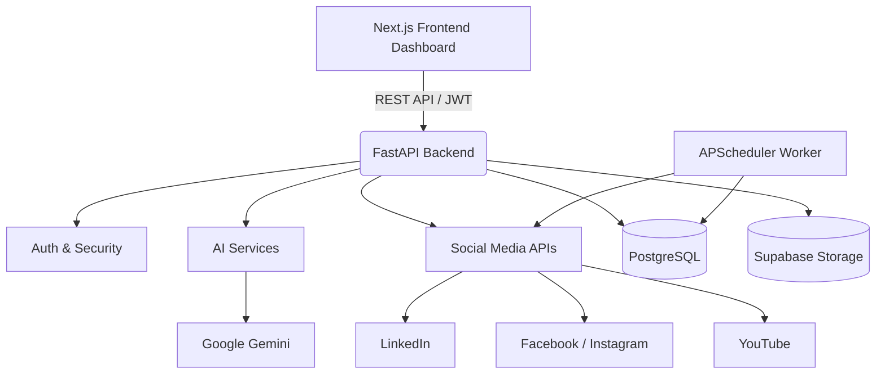
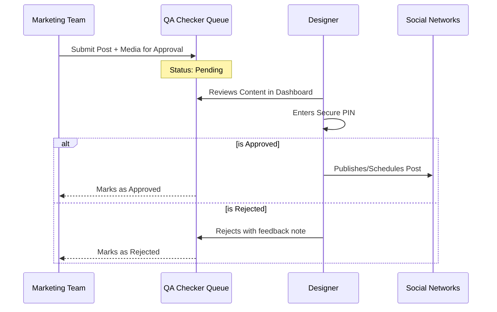

# Kafi Commodities — Social Media & Branding AI Agent

An end-to-end, in-house social media operations platform built for Kafi Commodities (Pvt) Ltd. This platform centralizes AI-powered content generation, designer quality assurance, multi-platform publishing, and competitor benchmarking into a single, cohesive dashboard.

## 🔗 Live Links & Repository

* **Live Dashboard (Frontend):** [Kafi Social Agent on Vercel](https://kafi-social-media-agent.vercel.app/)
* **GitHub Repository:** [izoo2003/Social-Media-Agent-With-Engagement-Rival-Analysis-](https://github.com/izoo2003/Social-Media-Agent-With-Engagement-Rival-Analysis-)
* **Backend API:** Deployed via Railway (FastAPI)

---

## 🎯 What This Project Does

* **Automates Content Creation:** Generates platform-specific social media captions using Google Gemini, tailored to brand voice and target audience.
* **Enforces Quality Control:** Routes posts through an in-app Designer Approval Queue before they can be published, ensuring brand safety without clunky email chains.
* **Simplifies Scheduling:** Offers a visual calendar to schedule, edit, or cancel posts, with an automated background worker handling the exact-time publishing.
* **Benchmarks Performance:** Tracks live platform analytics and actively monitors industry competitors (Rival Review) to deliver actionable AI insights.

---

## ✨ Core Features

### 1. Dashboard Authentication

* JWT-based username/password authentication securing all dashboard and API routes.
* Automatic session handling and redirects for unauthenticated users.
* Built-in brute-force protection (5 failed PIN/login attempts triggers a 15-minute IP lockout).

### 2. AI Content Generation & Social Posting

* **Multi-Platform:** Post directly to LinkedIn (up to 3 accounts), Facebook Pages, Instagram Business, and YouTube.
* **AI Captions:** Google Gemini integration crafts platform-optimized text based on topic, tone, and audience.
* **Media Uploads:** Magic-byte validated media uploads (images, videos, PDFs) stored securely in Supabase (production) or local disk. SVGs are blocked for XSS prevention.
* **Draft Mode:** A `DRAFT_MODE` toggle simulates posting workflows and API interactions without hitting live social networks, ensuring safe testing.

### 3. Content Calendar & Background Scheduler

* Month-grid visual calendar with an upcoming events sidebar.
* APScheduler background worker auto-publishes due posts every ~30 seconds.
* Complete lifecycle management: schedule, publish-now, edit, reschedule, or cancel.
* State recovery: Stuck "publishing" events are safely reclaimed after server restarts to prevent duplicate posts.

### 4. Designer Approval Workflow (QA Checker)

* **Strict Pipeline:** When `APPROVAL_REQUIRED=true`, standard team members cannot post directly.
* **In-App Queue:** Submissions land in the QA Checker queue containing the full posting payload.
* **Designer Verification:** Designers enter a secure PIN to approve/publish instantly or reject with a note—entirely within the app (no emails required).

### 5. Prompt Studio

* A dedicated, product-aware AI chatbot grounded in the Kafi/Essence product catalog.
* Crafts highly optimized image and video prompts for external tools (Meta AI, Midjourney, etc.).
* Multi-key Gemini fallback ensures high availability and quota resilience.

### 6. Analytics & Rival Review

* **Live Analytics:** Pulls views, reach, engagements, and watch time directly from social APIs (7, 30, and 90-day trend charts).
* **Competitor Intelligence:** Auto-seeds and tracks industry rivals (e.g., Shan Foods, National Foods) via YouTube Data API, Meta Graph API, and web scraping.
* **AI Insights:** Compares historical competitor snapshots against in-house metrics to generate strategic recommendations.

### 7. Security & Production Hardening

* Strict CORS configurations, security headers (HSTS, nosniff), and sanitized production errors.
* Extensive rate limiting across LLM generation, file uploads, PIN entries, and calendar endpoints.

---

## 🏛️ Architecture



---

## 💻 Tech Stack

| Layer | Technologies |
| --- | --- |
| **Frontend** | Next.js 14, React 18, TypeScript, Tailwind CSS, Recharts, date-fns, Lucide |
| **Backend** | FastAPI, Uvicorn, Python 3.10+, Pydantic v2, SQLAlchemy 2 |
| **Database** | PostgreSQL 14+ |
| **LLM** | Google Gemini API (Primary) / Ollama (Optional Local Dev) |
| **Storage** | Supabase Storage (Production) / Local Filesystem (Dev) |
| **Scheduling** | APScheduler |
| **Infrastructure** | Vercel (Frontend), Railway (Backend), Docker |

---

## 🗺️ Dashboard Guide

| Page | Route | Purpose |
| --- | --- | --- |
| **Login** | `/login` | JWT username/password auth entry point |
| **Dashboard** | `/dashboard` | High-level stat cards, recent content, QA pass rate |
| **Prompt Studio** | `/dashboard/creation` | AI chatbot for product-aware Meta AI image/video prompts |
| **Post Creator** | `/dashboard/generator` | Upload media, generate AI captions, post or schedule |
| **Calendar** | `/dashboard/calendar` | Visual scheduling and auto-publish queue management |
| **Analytics** | `/dashboard/analytics` | Live platform metrics and historical trend charts |
| **QA Checker** | `/dashboard/qa` | Designer approval queue for incoming posts |
| **Rival Review** | `/dashboard/rivals` | Competitor intelligence and comparative AI insights |
| **Settings** | `/dashboard/settings` | Platform connection status and OAuth token helpers |

---

## 🚦 Designer Approval Workflow



---

## 🚀 Quick Start (Local Development)

### 1. Backend Setup

```bash
cd backend
cp .env.example .env  # Fill in required variables
python -m venv venv
source venv/bin/activate  # or `venv\Scripts\activate` on Windows
pip install -r requirements.txt
python scripts/setup_db.py
python main.py
# Backend runs on http://localhost:8000

```

### 2. Frontend Setup

```bash
cd frontend
cp .env.local.example .env.local
npm install
npm run dev
# Frontend runs on http://localhost:3000

```

*Optional:* Run `docker-compose up -d` to spin up PostgreSQL and both services in containers.

---

## ⚙️ Configuration (Key Env Vars)

**Backend (`.env`)**

* `DATABASE_URL`: PostgreSQL connection string.
* `GEMINI_API_KEY` / `CREATION_GEMINI_API_KEY`: API keys for core content and Prompt Studio.
* `ENVIRONMENT`: `development` or `production`.
* `DRAFT_MODE`: `true` to block actual social posting during tests.
* `APPROVAL_REQUIRED`: `true` enforces the designer QA workflow.
* `DESIGNER_PIN`: Secure PIN for post approval.
* `DASHBOARD_USERNAME` / `DASHBOARD_PASSWORD` / `SECRET_KEY`: JWT authentication config.
* *Plus standard OAuth tokens for LinkedIn, Meta, YouTube, and Supabase keys.*

**Frontend (`.env.local`)**

* `NEXT_PUBLIC_API_URL`: Points to backend (e.g., Railway URL in production or `http://localhost:8000`).

---

## 📂 Project Structure

```text
├── backend/
│   ├── app/                # FastAPI application code (routers, models, services)
│   ├── scripts/            # DB setup and utility scripts
│   ├── main.py             # Uvicorn entry point
│   ├── requirements.txt
│   └── Dockerfile
├── frontend/
│   ├── src/
│   │   ├── app/            # Next.js App Router (Dashboard pages)
│   │   ├── components/     # Reusable React UI components
│   │   └── lib/            # API clients, utils, context
│   ├── package.json
│   └── tailwind.config.js
└── docker-compose.yml      # Local dev orchestration

```

---

## ☁️ Deployment

* **Frontend:** Deployed automatically via **Vercel** connected to the `main` branch. Ensures fast edge delivery and seamless CI/CD.
* **Backend:** Deployed via **Railway**. Uses the provided `Dockerfile` to build the FastAPI environment. Background scheduling (APScheduler) runs concurrently within the Uvicorn process.

---

**License:** MIT

**Author:** Built for Kafi Commodities (Pvt) Ltd.
